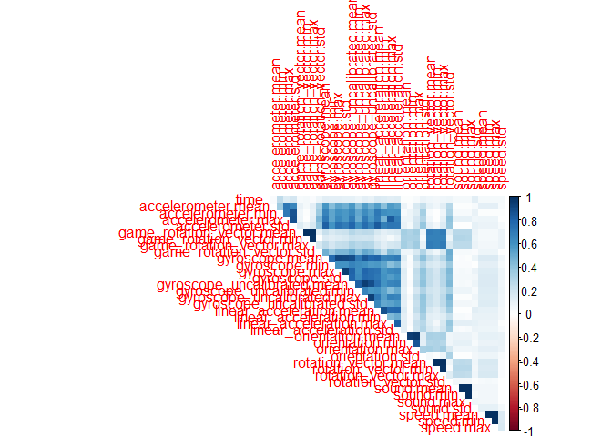

Travel Mode Detection
================
Zach Werginz
May 1, 2019

Reading data and visualizing data structures
============================================

``` r
tmd <- read.csv('dataset_5secondWindow%5B3%5D.csv', 
                col.names=c('time', 'accelerometer.mean', 'accelerometer.min', 
                            'accelerometer.max', 'accelerometer.std', 
                            'game_rotation_vector.mean','game_rotation_vector.min', 
                            'game_rotation_vector.max', 'game_rotation_vector.std',
                            'gyroscope.mean', 'gyroscope.min', 'gyroscope.max',
                            'gyroscope.std', 'gyroscope_uncalibrated.mean',
                            'gyroscope_uncalibrated.min', 'gyroscope_uncalibrated.max',
                            'gyroscope_uncalibrated.std', 'linear_acceleration.mean',
                            'linear_acceleration.min', 'linear_acceleration.max', 
                            'linear_acceleration.std', 'orientation.mean', 
                            'orientation.min', 'orientation.max', 'orientation.std',
                            'rotation_vector.mean', 'rotation_vector.min', 
                            'rotation_vector.max', 'rotation_vector.std', 
                            'sound.mean', 'sound.min', 'sound.max', 'sound.std',
                            'speed.mean', 'speed.min', 'speed.max', 'speed.std', 'target'))
summary(tmd)
```

    ##       time       accelerometer.mean accelerometer.min accelerometer.max
    ##  Min.   :  3.0   Min.   : 7.369     Min.   : 0.3372   Min.   : 8.801   
    ##  1st Qu.: 31.0   1st Qu.: 9.737     1st Qu.: 7.8053   1st Qu.:10.016   
    ##  Median : 70.0   Median : 9.850     Median : 9.1231   Median :10.602   
    ##  Mean   :117.7   Mean   :10.008     Mean   : 8.4263   Mean   :12.248   
    ##  3rd Qu.:152.0   3rd Qu.:10.079     3rd Qu.: 9.6917   3rd Qu.:12.292   
    ##  Max.   :682.0   Max.   :17.427     Max.   :12.1150   Max.   :66.886   
    ##  accelerometer.std   game_rotation_vector.mean game_rotation_vector.min
    ##  Min.   : 0.001286   Min.   :0.0000            Min.   :0.0000          
    ##  1st Qu.: 0.078055   1st Qu.:0.4439            1st Qu.:0.4144          
    ##  Median : 0.369163   Median :0.7797            Median :0.7500          
    ##  Mean   : 0.982987   Mean   :0.6563            Mean   :0.6430          
    ##  3rd Qu.: 1.058376   3rd Qu.:0.9567            3rd Qu.:0.9519          
    ##  Max.   :12.879851   Max.   :1.0000            Max.   :1.0000          
    ##  game_rotation_vector.max game_rotation_vector.std gyroscope.mean    
    ##  Min.   :0.0000           Min.   :0.0000000        Min.   :0.000000  
    ##  1st Qu.:0.4598           1st Qu.:0.0000725        1st Qu.:0.007377  
    ##  Median :0.8040           Median :0.0010829        Median :0.035267  
    ##  Mean   :0.6670           Mean   :0.0102637        Mean   :0.274351  
    ##  3rd Qu.:0.9623           3rd Qu.:0.0076437        3rd Qu.:0.205268  
    ##  Max.   :1.0000           Max.   :0.3244661        Max.   :5.662153  
    ##  gyroscope.min      gyroscope.max      gyroscope.std     
    ##  Min.   :0.000000   Min.   : 0.00000   Min.   :0.000000  
    ##  1st Qu.:0.002044   1st Qu.: 0.01488   1st Qu.:0.003247  
    ##  Median :0.008777   Median : 0.07806   Median :0.019004  
    ##  Mean   :0.078560   Mean   : 0.64524   Mean   :0.166669  
    ##  3rd Qu.:0.054033   3rd Qu.: 0.53205   3rd Qu.:0.135955  
    ##  Max.   :3.232744   Max.   :28.86075   Max.   :4.980892  
    ##  gyroscope_uncalibrated.mean gyroscope_uncalibrated.min
    ##  Min.   :0.00000             Min.   :0.00000           
    ##  1st Qu.:0.03053             1st Qu.:0.01372           
    ##  Median :0.04899             Median :0.03194           
    ##  Mean   :0.27039             Mean   :0.10842           
    ##  3rd Qu.:0.19828             3rd Qu.:0.07274           
    ##  Max.   :3.86319             Max.   :3.78552           
    ##  gyroscope_uncalibrated.max gyroscope_uncalibrated.std
    ##  Min.   : 0.00000           Min.   :0.000000          
    ##  1st Qu.: 0.04131           1st Qu.:0.003238          
    ##  Median : 0.07320           Median :0.016687          
    ##  Mean   : 0.53158           Mean   :0.150650          
    ##  3rd Qu.: 0.40361           3rd Qu.:0.118905          
    ##  Max.   :10.78951           Max.   :4.012268          
    ##  linear_acceleration.mean linear_acceleration.min linear_acceleration.max
    ##  Min.   : 0.00000         Min.   : 0.00000        Min.   : 0.00000       
    ##  1st Qu.: 0.05389         1st Qu.: 0.02981        1st Qu.: 0.07149       
    ##  Median : 0.37925         Median : 0.19336        Median : 0.52166       
    ##  Mean   : 1.20565         Mean   : 0.79073        Mean   : 1.97672       
    ##  3rd Qu.: 1.20468         3rd Qu.: 0.81763        3rd Qu.: 1.81298       
    ##  Max.   :23.11084         Max.   :23.11084        Max.   :67.33059       
    ##  linear_acceleration.std orientation.mean orientation.min  orientation.max
    ##  Min.   : 0.00000        Min.   :  0.0    Min.   :  0.00   Min.   :  0.0  
    ##  1st Qu.: 0.01688        1st Qu.:118.1    1st Qu.: 96.52   1st Qu.:125.2  
    ##  Median : 0.14377        Median :200.3    Median :187.53   Median :204.8  
    ##  Mean   : 0.54928        Mean   :194.7    Mean   :183.07   Mean   :205.8  
    ##  3rd Qu.: 0.55623        3rd Qu.:289.6    3rd Qu.:272.64   3rd Qu.:311.4  
    ##  Max.   :11.63665        Max.   :403.5    Max.   :403.49   Max.   :410.6  
    ##  orientation.std    rotation_vector.mean rotation_vector.min
    ##  Min.   :  0.0000   Min.   :0.0000       Min.   :0.0000     
    ##  1st Qu.:  0.1212   1st Qu.:0.3897       1st Qu.:0.3710     
    ##  Median :  0.9429   Median :0.8135       Median :0.7862     
    ##  Mean   : 11.3863   Mean   :0.6722       Mean   :0.6585     
    ##  3rd Qu.:  5.5880   3rd Qu.:0.9679       3rd Qu.:0.9627     
    ##  Max.   :245.4210   Max.   :1.0000       Max.   :1.0000     
    ##  rotation_vector.max rotation_vector.std   sound.mean      sound.min    
    ##  Min.   :0.0000      Min.   :0.0000000   Min.   : 0.00   Min.   : 0.00  
    ##  1st Qu.:0.4114      1st Qu.:0.0001254   1st Qu.:58.40   1st Qu.:57.74  
    ##  Median :0.8486      Median :0.0021568   Median :79.48   Median :79.09  
    ##  Mean   :0.6837      Mean   :0.0113691   Mean   :65.45   Mean   :65.22  
    ##  3rd Qu.:0.9751      3rd Qu.:0.0096874   3rd Qu.:89.72   3rd Qu.:89.72  
    ##  Max.   :1.0000      Max.   :0.4396291   Max.   :90.31   Max.   :90.31  
    ##    sound.max       sound.std          speed.mean       speed.min     
    ##  Min.   : 0.00   Min.   : 0.00000   Min.   : 0.000   Min.   : 0.000  
    ##  1st Qu.:58.88   1st Qu.: 0.00000   1st Qu.: 0.000   1st Qu.: 0.000  
    ##  Median :79.86   Median : 0.03718   Median : 0.000   Median : 0.000  
    ##  Mean   :65.67   Mean   : 1.31866   Mean   : 4.919   Mean   : 4.908  
    ##  3rd Qu.:89.73   3rd Qu.: 1.48786   3rd Qu.: 5.250   3rd Qu.: 5.180  
    ##  Max.   :90.31   Max.   :26.83555   Max.   :51.360   Max.   :51.360  
    ##    speed.max        speed.std         target    
    ##  Min.   : 0.000   Min.   :0.000   Bus    :1178  
    ##  1st Qu.: 0.000   1st Qu.:0.000   Car    :1180  
    ##  Median : 0.000   Median :0.000   Still  :1179  
    ##  Mean   : 4.930   Mean   :0.053   Train  :1179  
    ##  3rd Qu.: 5.356   3rd Qu.:0.000   Walking:1177  
    ##  Max.   :51.360   Max.   :3.843

``` r
str(tmd)
```

    ## 'data.frame':    5893 obs. of  38 variables:
    ##  $ time                       : num  78 145 150 105 77 559 41 20 35 27 ...
    ##  $ accelerometer.mean         : num  9.81 9.94 9.83 9.67 9.99 ...
    ##  $ accelerometer.min          : num  9.76 7.71 9.8 7.66 8.97 ...
    ##  $ accelerometer.max          : num  9.85 17.15 9.85 12.3 10.89 ...
    ##  $ accelerometer.std          : num  0.0146 1.7759 0.0112 0.8626 0.5041 ...
    ##  $ game_rotation_vector.mean  : num  0.0293 0.9999 0.6652 0.9962 0.5638 ...
    ##  $ game_rotation_vector.min   : num  0.029 1 0.665 0.994 0.522 ...
    ##  $ game_rotation_vector.max   : num  0.0295 0.9999 0.6652 0.9987 0.6727 ...
    ##  $ game_rotation_vector.std   : num  1.19e-04 3.01e-05 3.97e-06 3.45e-03 6.48e-02 ...
    ##  $ gyroscope.mean             : num  0.00165 0.03633 0.00152 0.03644 0.1832 ...
    ##  $ gyroscope.min              : num  0 0.0117 0 0.0205 0.0207 ...
    ##  $ gyroscope.max              : num  0.00353 0.05939 0.00261 0.05251 0.38088 ...
    ##  $ gyroscope.std              : num  0.000737 0.02029 0.000713 0.010553 0.098819 ...
    ##  $ gyroscope_uncalibrated.mean: num  0.0162 0.039 0.0163 0.0508 0.2657 ...
    ##  $ gyroscope_uncalibrated.min : num  0.0142 0.0141 0.0146 0.0247 0.1412 ...
    ##  $ gyroscope_uncalibrated.max : num  0.0187 0.0855 0.0174 0.0819 0.313 ...
    ##  $ gyroscope_uncalibrated.std : num  0.000982 0.018629 0.000876 0.018037 0.083175 ...
    ##  $ linear_acceleration.mean   : num  0.021 0.8792 0.0341 1.4884 1.6583 ...
    ##  $ linear_acceleration.min    : num  0.0025 0.6411 0.0257 0.5759 0.3798 ...
    ##  $ linear_acceleration.max    : num  0.0524 1.1858 0.0425 2.4159 2.796 ...
    ##  $ linear_acceleration.std    : num  0.011 0.2787 0.0119 0.9201 1.1222 ...
    ##  $ orientation.mean           : num  354.3 332.7 74.8 373.6 193.2 ...
    ##  $ orientation.min            : num  353.6 330.5 73.2 359.9 35.9 ...
    ##  $ orientation.max            : num  354.9 339.1 75.3 397.1 360.6 ...
    ##  $ orientation.std            : num  0.246 1.706 0.414 8.87 181.729 ...
    ##  $ rotation_vector.mean       : num  0.0504 1 0.6105 0.9981 0.3222 ...
    ##  $ rotation_vector.min        : num  0.0448 1 0.6105 0.9981 0.3081 ...
    ##  $ rotation_vector.max        : num  0.0564 1 0.6105 0.9981 0.3782 ...
    ##  $ rotation_vector.std        : num  2.11e-03 2.57e-05 1.13e-02 2.79e-03 2.56e-02 ...
    ##  $ sound.mean                 : num  0 89.2 0 87.5 89.8 ...
    ##  $ sound.min                  : num  0 89.1 0 87.5 89.8 ...
    ##  $ sound.max                  : num  0 89.3 0 87.5 89.8 ...
    ##  $ sound.std                  : num  0 0.19101 0 2.28419 0.00639 ...
    ##  $ speed.mean                 : num  0 16.5 0 17.7 9 ...
    ##  $ speed.min                  : num  0 16.5 0 17.7 9 ...
    ##  $ speed.max                  : num  0 16.5 0 17.7 9 ...
    ##  $ speed.std                  : num  0 0.629 0 0.629 0 ...
    ##  $ target                     : Factor w/ 5 levels "Bus","Car","Still",..: 3 2 3 2 2 2 4 1 1 4 ...

``` r
corrplot(abs(cor(tmd[, 1:37])), method='color', diag=FALSE, type='upper')
```


